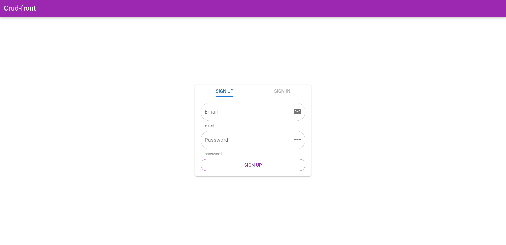

## CRUD PROJECT FRONTEND

### What can it do:

1. Sign up
2. Sign in
3. Edit profile page
4. Save information
5. Log out

### Developed with the help of [Quasar Framework](https://quasar.dev/)

### App deployed in [Render](https://crud-front.onrender.com/#/)

To start it up:

1. You need to clone repository to you
2. To install all dependencies: `npm i`
3. To start in dev mode: `npm run start`
4. To build project: `npm run build`
